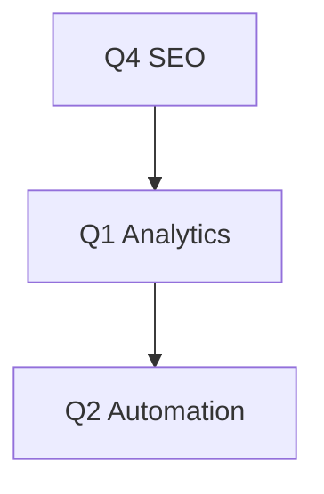

## Recent Updates

Ajnas A continuously evolves to enhance your SEO, PPC, and social media campaigns. Review the latest releases below to see how these updates impact your workflows. You receive automatic notifications in the dashboard when new versions deploy.

<Callout kind="info">
  Enable update notifications in your account settings to stay informed about releases that boost your ROI.
</Callout>

<Update label="2024-10-15" description="v1.2.0" tags={["feature", "improvement"]}>

## New Features

- Enhanced SEO algorithms now support real-time keyword gap analysis, identifying opportunities with up to `350%` higher conversion potential.
- New PPC bidding options include AI-driven smart bidding, automating bids based on historical performance data.

## Improvements

- Optimized dashboard load times by `40%` for faster campaign reviews.
- Updated social media integration with Instagram Reels and TikTok analytics.

## Bug Fixes

- Fixed intermittent sync issues with Google Ads API.
- Resolved keyword tracking discrepancies in competitive analysis reports.

</Update>

<Update label="2024-09-20" description="v1.1.0" tags={["feature", "bugfix"]}>

## New Features

- Added advanced social media scheduling with A/B testing for posts across platforms.
- Introduced performance marketing dashboards with customizable ROI calculators.

## Bug Fixes

- Corrected PPC campaign pause/resume functionality during peak hours.
- Patched SEO audit tool to handle sites with `>10,000` pages accurately.

</Update>

<Update label="2024-08-10" description="v1.0.0" tags={["feature", "breaking"]}>

## New Features

- Core SEO toolkit with on-page optimization and backlink monitoring.
- PPC management console integrated with major ad networks.
- Social media performance tracking for UAE-specific audiences.

## Breaking Changes

- Updated API endpoints to `https://api.ajnas-a.com/v2/`; migrate your integrations.

## Initial Setup

Run this command to verify your version:

<CodeGroup tabs="JavaScript,Bash">
  ```javascript
  const response = await fetch('https://api.ajnas-a.com/version');
  console.log(response.status); // 200 for latest
  ```
  ```bash
  curl -H "Authorization: Bearer YOUR_API_KEY" https://api.ajnas-a.com/version
  ```
</CodeGroup>

</Update>

## Upgrade Instructions

Follow these steps to ensure you run the latest version.

<Steps>
  <Step title="Check Current Version" icon="check-circle">

  Log in to `https://dashboard.ajnas-a.com` and navigate to Settings `{>}` Account.

  </Step>
  <Step title="Review Changes" icon="book-open">

  Scan the changelog above for breaking changes in your workflows.

  </Step>
  <Step title="Update Integrations" icon="settings">

````javascript
// Example: Update your PPC bidding config
const config = {
  biddingStrategy: 'smart-ai', // New in v1.2.0
  targetROI: 3.5, // 350% ROI target
  platforms: ['google', 'facebook']
};
````

  </Step>
  <Step title="Test Campaigns" icon="zap">

  Run a test campaign to validate `>20%` performance uplift.

  </Step>
</Steps>

## Upcoming Roadmap

<Columns cols={3}>
  <Card title="Q4 2024" icon="calendar" href="#">
    Advanced voice search SEO and AR ad integrations.
  </Card>
  <Card title="Q1 2025" icon="trending-up" href="#">
    Predictive analytics for social trends in UAE markets.
  </Card>
  <Card title="Q2 2025" icon="rocket" href="#">
    Full automation suite for end-to-end campaigns.
  </Card>
</Columns>

<Expandable title="Detailed Roadmap" default-open="false">

Explore phased rollouts:



</Expandable>